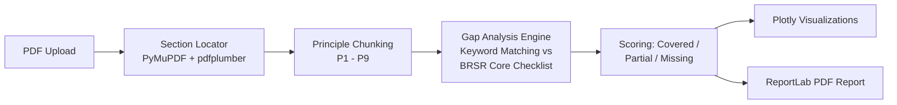

<div align="center">

# BRSR Gap Analysis Tool

**Automated compliance screening for SEBI's BRSR Core disclosure framework**

[](https://www.python.org/)
[](https://streamlit.io/)
[](LICENSE)
[](#roadmap--known-limitations)

[Live Demo](https://brsr-gap-analysis-tool-lhzxeq4qppvkst7wjgfn84.streamlit.app/) · [Report an Issue](https://github.com/karan02566-prog/BRSR-gap-analysis-tool/issues) · [Author](https://www.linkedin.com/in/karan-thakur-3486b538a/)

</div>

---

## Table of Contents

- [The Problem](#the-problem)
- [What This Tool Does](#what-this-tool-does)
- [Demo](#demo)
- [Architecture](#architecture)
- [Methodology](#methodology)
- [Tech Stack](#tech-stack)
- [Getting Started](#getting-started)
- [Project Structure](#project-structure)
- [Roadmap & Known Limitations](#roadmap--known-limitations)
- [Motivation](#motivation)
- [Author](#author)
- [License](#license)

---

## The Problem

In July 2023, SEBI mandated that the top 1,000 listed companies in India report against **BRSR Core** — nine ESG attributes (from GHG emissions intensity to gender diversity in leadership) that require **reasonable assurance** by an independent third party, not just self-disclosure.

For an ESG analyst, checking whether a company's annual report actually covers all nine attributes means manually reading a 100+ page PDF, cross-referencing it line by line against SEBI's disclosure checklist, and noting what's present, partial, or missing entirely. This is slow, repetitive, and exactly the kind of first-pass screening that shouldn't require a human doing manual search-and-scan work.

This tool automates that first pass.

## What This Tool Does

Upload a company's Annual Report or standalone BRSR filing (PDF), and the tool returns:

- **Overall BRSR Core coverage score** — a single number showing how complete the filing is
- **Attribute-by-attribute breakdown** — each of the 9 BRSR Core attributes flagged as Covered, Partially Covered, or Missing
- **Interactive visualizations** — gauge, donut, bar, and radar charts built with Plotly
- **A downloadable PDF summary report** — shareable output for further review

It is designed as a **screening tool**, not a certification tool — it tells you where to look closer, not whether a company is compliant.

## Demo

**Live app:** https://brsr-gap-analysis-tool-lhzxeq4qppvkst7wjgfn84.streamlit.app/

*(Add a screenshot or short GIF of the dashboard here — this is the single highest-impact addition you can make to this README. A recruiter will look at the image before reading a single line of text.)*

## Architecture



## Methodology

1. **PDF Parsing** — Locates the "Principle-wise Performance" section of a BRSR filing, handling formatting inconsistencies across companies (capitalization differences, varying section headers, inconsistent table structures).
2. **Text Chunking** — Splits the filing into its 9 constituent Principles (P1–P9) for structured, attribute-level analysis.
3. **Gap Analysis** — Compares extracted disclosures against a reference checklist of BRSR Core's 9 ESG attributes using keyword matching, flagging each as Covered, Partially Covered, or Missing.
4. **Reporting** — Renders results as interactive visualizations and generates a downloadable PDF summary.

**A note on accuracy:** the current scoring engine uses keyword matching rather than semantic understanding. This means it can produce false negatives (a disclosure phrased unusually may be flagged as missing) and false positives (a keyword present without genuine substantive disclosure may be flagged as covered). Treat the output as a **first-pass screen** to direct manual review, not a final compliance verdict. Improving this is the top item on the roadmap below.

## Tech Stack

| Layer | Technology |
|---|---|
| Web application | Streamlit |
| PDF text extraction | PyMuPDF, pdfplumber |
| Visualization | Plotly |
| Report generation | ReportLab |
| Structured disclosure extraction (case studies) | Claude (Anthropic), used in a companion pipeline for Tata Steel, Infosys, and ITC |

## Getting Started

```bash
git clone https://github.com/karan02566-prog/BRSR-gap-analysis-tool.git
cd BRSR-gap-analysis-tool
pip install -r requirements.txt
streamlit run app.py
```

The app will open at `http://localhost:8501`.

## Project Structure

```
├── app.py                      # Main Streamlit application
├── brsr_core_reference.json    # BRSR Core attribute reference checklist
├── requirements.txt            # Python dependencies
└── README.md
```

## Roadmap & Known Limitations

- [ ] Replace keyword matching with a semantic/LLM-based classifier for higher-precision gap detection
- [ ] Expand the reference checklist to cover full BRSR (not just BRSR Core) disclosures
- [ ] Add support for batch processing across multiple companies for peer benchmarking
- [ ] Add automated regression tests against a labeled set of known BRSR filings
- [ ] Improve PDF section detection for filings with non-standard formatting or scanned/image-based pages

## Motivation

This project started as an attempt to understand how BRSR compliance is actually assessed in practice, rather than just reading about the framework. Building the extraction and scoring pipeline meant working through the same ambiguity ESG analysts deal with — inconsistent formatting, vague disclosure language, and judgment calls about what counts as "covered." That process shaped the tool as much as the destination did.

## Author

**Karan Thakur**
Geography Honours, Delhi University — exploring ESG analytics and sustainability consulting.

[GitHub](https://github.com/karan02566-prog) · [LinkedIn](https://www.linkedin.com/in/karan-thakur-3486b538a/)

## License

Distributed under the MIT License. See `LICENSE` for details.
