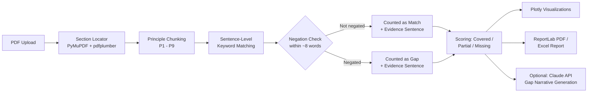

<div align="center">

# 📊 BRSR Gap Analysis Tool

**Automated, evidence-backed compliance screening for SEBI's BRSR Core disclosure framework**

[](https://www.python.org/)
[](https://streamlit.io/)
[](https://www.anthropic.com/)
[](LICENSE)
[](#roadmap--known-limitations)

[Live Demo](https://brsr-gap-analysis-tool-lhzxeq4qppvkst7wjgfn84.streamlit.app/) · [Report an Issue](https://github.com/karan02566-prog/BRSR-gap-analysis-tool/issues) · [Author](https://www.linkedin.com/in/karan-thakur-3486b538a/)

</div>

---

## Table of Contents

- [The Problem](#the-problem)
- [What This Tool Does](#what-this-tool-does)
- [What Makes This Different](#what-makes-this-different)
- [Demo](#demo)
- [Architecture](#architecture)
- [Methodology](#methodology)
- [Tech Stack](#tech-stack)
- [Getting Started](#getting-started)
- [Project Structure](#project-structure)
- [Roadmap & Known Limitations](#roadmap--known-limitations)
- [Motivation](#motivation)
- [Author](#author)
- [License](#license)

---

## The Problem

In July 2023, SEBI mandated that the top 1,000 listed companies in India report against **BRSR Core** — nine ESG attributes (from GHG emissions intensity to gender diversity in leadership) that require **reasonable assurance** by an independent third party, not just self-disclosure.

For an ESG analyst, checking whether a company's annual report actually covers all nine attributes means manually reading a 100+ page PDF, cross-referencing it line by line against SEBI's disclosure checklist, and noting what's present, partial, or missing entirely. This is slow, repetitive, and exactly the kind of first-pass screening that shouldn't require a human doing manual search-and-scan work.

This tool automates that first pass — and, unlike a simple keyword count, shows its work.

## What This Tool Does

Upload a company's Annual Report or standalone BRSR filing (PDF), and the tool returns:

- **Overall BRSR Core coverage score** — a single number showing how complete the filing is
- **Attribute-by-attribute breakdown** — each of the 9 BRSR Core attributes flagged as ✅ Covered, 🟡 Partially Covered, or 🔴 Missing
- **Sentence-level evidence** — every match (or rejected match) links to the exact sentence it came from, so the score is auditable, not a black box
- **In-app methodology disclosure** — a reviewer-facing breakdown of exactly how each score is calculated, visible inside the app itself
- **Interactive visualizations** — gauge, donut, horizontal bar, radar, and sunburst charts built with Plotly, plus a drill-down filter by Principle
- **Downloadable PDF and Excel reports** — shareable, presentation-ready output for further review
- **Optional AI-generated gap narratives** — for any Partial/Missing attribute, generate a short auditor-style narrative (what's missing, why SEBI cares, what to disclose next cycle) via the Claude API. Fully opt-in — the app works completely without an API key; this only activates if you supply your own.

It is designed as a **screening tool**, not a certification tool — it tells you where to look closer, not whether a company is compliant.

## What Makes This Different

Most keyword-matching compliance checkers stop at "does this word appear in the document." That produces false positives — a filing that says *"there is no water recycling program"* would still register as "covered" under naive matching, because the keyword `water recycling` is technically present.

This tool checks the **context around every keyword match**, not just its presence:

| | Naive keyword matcher | This tool |
|---|---|---|
| Detects keyword presence | ✅ | ✅ |
| Catches negated disclosures (*"no X program"*) | ❌ | ✅ |
| Shows the sentence behind each score | ❌ | ✅ |
| Publishes its scoring methodology in-app | ❌ | ✅ |
| Explains gaps in plain-English narrative | ❌ | ✅ (optional, AI-powered) |

## Demo

**Live app:** https://brsr-gap-analysis-tool-lhzxeq4qppvkst7wjgfn84.streamlit.app/


## Architecture



## Methodology

1. **PDF Parsing** — Locates the "Principle-wise Performance" section of a BRSR filing, handling formatting inconsistencies across companies (capitalization differences, varying section headers, inconsistent table structures).
2. **Text Chunking** — Splits the filing into its 9 constituent Principles (P1–P9) for structured, attribute-level analysis.
3. **Sentence-Level Keyword Matching** — Each of the 9 BRSR Core attributes has a defined set of keywords (e.g. *GHG Footprint* → `scope 1`, `scope 2`, `scope 3`, `ghg`, `emission intensity`), stored in `brsr_core_reference.json` and mapped to its BRSR Principle. The filing is split into sentences, and each keyword is checked within that sentence-level context rather than across the raw text blob.
4. **Negation Filtering** — For every keyword match, the ~8 words preceding it are checked against a negation pattern list (`no`, `not`, `without`, `lack of`, `does not`, `excluding`, etc.). A negated match is excluded from the coverage count and instead surfaced as a flagged gap with its evidence sentence — so a filing that denies a disclosure isn't mistakenly credited for making it.
5. **Scoring** — Coverage % = (keywords genuinely matched) ÷ (total keywords for that attribute). ≥50% → ✅ Covered · >0% → 🟡 Partially Covered · 0% → 🔴 Missing.
6. **Evidence Trail** — Every match and every negated non-match is linked back to its source sentence, viewable per-attribute in the app, so a reviewer can verify the score rather than trust it blindly.
7. **Reporting** — Renders results as interactive visualizations and generates downloadable PDF/Excel summaries. If an Anthropic API key is supplied, gap narratives are generated per attribute and folded into the PDF report.

**A note on accuracy:** the scoring engine uses sentence-level keyword and negation matching, not full semantic understanding. This closes the most common false-positive failure mode (negated disclosures) but a filing phrased with unlisted synonyms can still be under-detected. Treat the output as a **first-pass screen** to direct manual review, not a final compliance verdict — the in-app methodology section states this explicitly for reviewers.

## Tech Stack

| Layer | Technology |
|---|---|
| Web application | Streamlit |
| PDF text extraction | PyMuPDF, pdfplumber |
| Visualization | Plotly |
| Report generation | ReportLab, openpyxl |
| AI gap narratives (optional) | Claude API (Anthropic) |

## Getting Started

```bash
git clone https://github.com/karan02566-prog/BRSR-gap-analysis-tool.git
cd BRSR-gap-analysis-tool
pip install -r requirements.txt
streamlit run app.py
```

The app will open at `http://localhost:8501`.

To enable AI-generated gap narratives, either:
- Add `ANTHROPIC_API_KEY = "sk-ant-..."` to `.streamlit/secrets.toml`, or
- Paste your key into the "AI Narratives" field in the app's sidebar at runtime (session-only, never stored)

This step is entirely optional — every other feature works without it.

## Project Structure

```
├── app.py                      # Main Streamlit application
├── brsr_core_reference.json    # BRSR Core attribute reference checklist
├── requirements.txt            # Python dependencies
└── README.md
```

## Roadmap & Known Limitations

- [x] ~~Reduce false positives from naive keyword matching~~ — addressed via sentence-level negation detection
- [x] ~~Make scoring auditable rather than a black box~~ — addressed via evidence sentence trail + in-app methodology disclosure
- [ ] Extend context checking beyond negation to broader semantic/LLM-based classification for higher-precision gap detection
- [ ] Expand the reference checklist to cover full BRSR (not just BRSR Core) disclosures
- [ ] Add support for multi-company / multi-year comparison for peer and YoY benchmarking
- [ ] Add automated regression tests against a labeled set of known BRSR filings
- [ ] Improve PDF section detection for filings with non-standard formatting or scanned/image-based pages

## Motivation

This project started as an attempt to understand how BRSR compliance is actually assessed in practice, rather than just reading about the framework. Building the extraction and scoring pipeline meant working through the same ambiguity ESG analysts deal with — inconsistent formatting, vague disclosure language, and judgment calls about what counts as "covered." That process shaped the tool as much as the destination did. Adding negation-aware matching and an evidence trail came directly from stress-testing the first version against real filings and catching it being wrong.

## Author

**Karan Thakur**
Geography Honours, Delhi University — exploring ESG analytics and sustainability consulting.

[GitHub](https://github.com/karan02566-prog) · [LinkedIn](https://www.linkedin.com/in/karan-thakur-3486b538a/)

## License

Distributed under the MIT License. See `LICENSE` for details.
